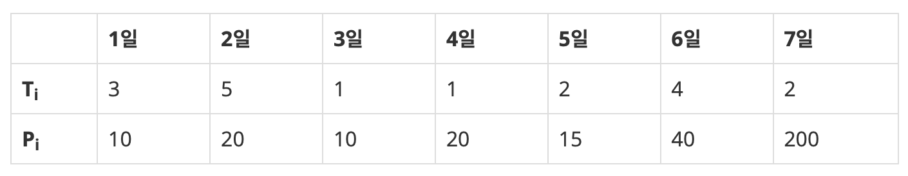

**[원본 문제](https://www.acmicpc.net/problem/14501)**

### 문제 설명

상담원으로 일하고 있는 백준이는 퇴사를 하려고 한다.

오늘부터 N+1일째 되는 날 퇴사를 하기 위해서, 남은 N일 동안 최대한 많은 상담을 하려고 한다.

백준이는 비서에게 최대한 많은 상담을 잡으라고 부탁을 했고, 비서는 하루에 하나씩 서로 다른 사람의 상담을 잡아놓았다.

각각의 상담은 상담을 완료하는데 걸리는 기간 Ti와 상담을 했을 때 받을 수 있는 금액 Pi로 이루어져 있다.

N = 7인 경우에 다음과 같은 상담 일정표를 보자.



1일에 잡혀있는 상담은 총 3일이 걸리며, 상담했을 때 받을 수 있는 금액은 10이다. 5일에 잡혀있는 상담은 총 2일이 걸리며, 받을 수 있는 금액은 15이다.

상담을 하는데 필요한 기간은 1일보다 클 수 있기 때문에, 모든 상담을 할 수는 없다. 예를 들어서 1일에 상담을 하게 되면, 2일, 3일에 있는 상담은 할 수 없게 된다. 2일에 있는 상담을 하게 되면, 3, 4, 5, 6일에 잡혀있는 상담은 할 수 없다.

또한, N+1일째에는 회사에 없기 때문에, 6, 7일에 있는 상담을 할 수 없다.

퇴사 전에 할 수 있는 상담의 최대 이익은 1일, 4일, 5일에 있는 상담을 하는 것이며, 이때의 이익은 10+20+15=45이다.

상담을 적절히 했을 때, 백준이가 얻을 수 있는 최대 수익을 구하는 프로그램을 작성하시오.

### 입력

첫째 줄에 N과 K가 주어진다. (1 ≤ N ≤ 10, 1 ≤ K ≤ 100,000,000)

둘째 줄부터 N개의 줄에 동전의 가치 Ai가 오름차순으로 주어진다. (1 ≤ Ai ≤ 1,000,000, A1 = 1, i ≥ 2인 경우에 Ai는 Ai-1의 배수)


### 출력

첫째 줄에 백준이가 얻을 수 있는 최대 이익을 출력한다.


### 테스트 케이스1

|입력|출력|
|-----|-----|
|7<br>3 10<br>5 20<br>1 10<br>1 20<br>2 15<br>4 40<br>2 200|45|

### 테스트 케이스2

|입력|출력|
|-----|-----|
|10<br>1 1<br>1 2<br>1 3<br>1 4<br>1 5<br>1 6<br>1 7<br>1 8<br>1 9<br>1 10|55|

### 테스트 케이스3

|입력|출력|
|-----|-----|
|10<br>5 10<br>5 9<br>5 8<br>5 7<br>5 6<br>5 10<br>5 9<br>5 8<br>5 7<br>5 6|20|

### 테스트 케이스4

|입력|출력|
|-----|-----|
|10<br>5 50<br>4 40<br>3 30<br>2 20<br>1 10<br>1 10<br>2 20<br>3 30<br>4 40<br>5 50|90|

### 문제 풀이1

```kotlin
import java.io.BufferedReader
import java.io.InputStreamReader

fun main() = with(BufferedReader(InputStreamReader(System.`in`))) {
    val n = readLine().toInt()
    var times: IntArray = IntArray(n + 1)
    var estimates: IntArray = IntArray(n + 1)
    var dp: IntArray = IntArray(n + 2) { 0 }

    for (i in 1 until n + 1) {
        val (time: Int, estimate: Int) = readLine()
            .split(" ")
            .map { it.toInt() }

        times[i] = time
        estimates[i] = estimate
    }

    var max: Int = 0

    for (i in 1 until n + 1) {
        val next = i - 1 + times[i]
        dp[i] = Math.max(dp[i], max)

        if (next <= n) {
            dp[next] = Math.max(dp[next], estimates[i] + dp[i - 1])
        }

        if (max < dp[i]) max = dp[i]
    }
    println(max)
}
```
