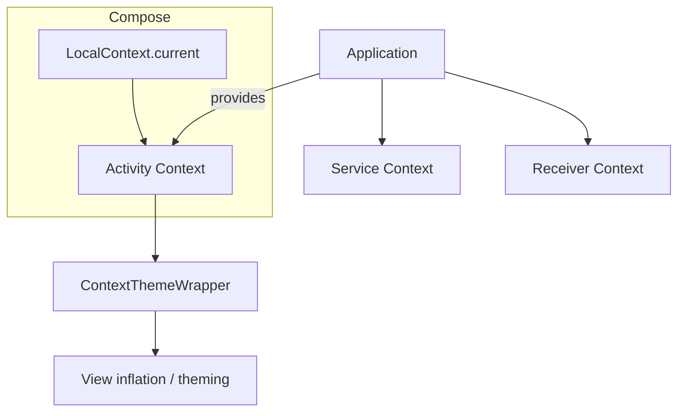
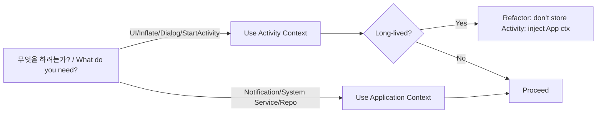
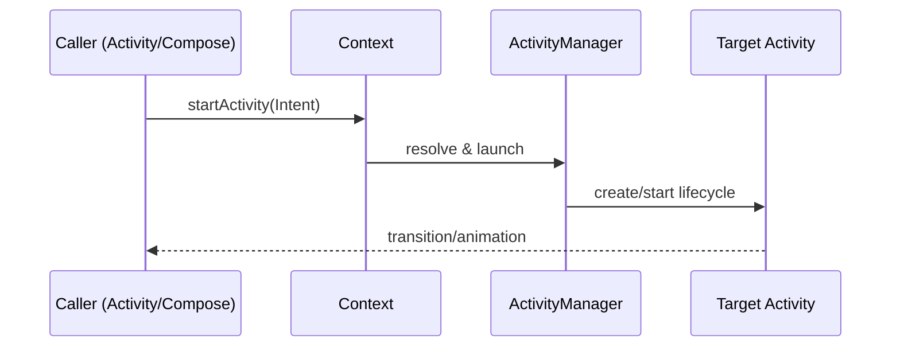

# Android **Context** 실전 가이드 · Deep-Dive  
*Android **Context** Practical Guide · Deep-Dive*

Context는 **앱 환경에 접근하는 핸들**이며 리소스/서비스/컴포넌트 실행을 위한 **OS 게이트웨이**이다.  
*Context is the handle to the app environment—the **gateway** to resources, services, and component execution.*

핵심은 **올바른 종류의 Context를 올바른 수명 범위에서 사용**하는 것이다. 잘못 쓰면 **메모리 누수**나 **크래시**가 발생한다.  
*The key is to **match the correct Context type with its lifetime**; misuse leads to **memory leaks** and **crashes**.*

---

## 1) Context 패밀리 한눈에 보기 · Landscape  
*1) Context Family at a Glance · Landscape*

- **Application Context**: 앱 전체 수명과 동일하며 프로세스 내 **싱글톤**이다.  
  *Application Context: Lives for the whole app process; effectively a **singleton**.*

- **Activity Context**: 화면(뷰 트리) 생명주기와 같으며 **UI 관련 작업**과 `startActivity()`에 적합하다.  
  *Activity Context: Scoped to a screen (view tree); good for **UI tasks** and `startActivity()`.*

- **Service Context**: 백그라운드 작업 컴포넌트의 범위에서 동작한다.  
  *Service Context: Scoped to a background service component.*

- **BroadcastReceiver Context**: 매우 짧은 수명이므로 빠른 처리만 수행해야 한다.  
  *BroadcastReceiver Context: Very short-lived; do work quickly.*

- **ContextThemeWrapper**: 특정 **테마가 적용된** 래퍼 컨텍스트다.  
  *ContextThemeWrapper: A wrapper **applying a theme**.*

- **`baseContext` 체인**: 래핑된 컨텍스트의 **원본**을 가리키는 루트다.  
  *`baseContext` chain: Root reference to the **underlying** wrapped context.*

- **Compose `LocalContext.current`**: 현재 컴포지션 트리의 컨텍스트(보통 **Activity**)를 노출한다.  
  *Compose `LocalContext.current`: Exposes the context of the current composition (usually an **Activity**).*

### 관계도 · Diagram  
*Relationship Diagram*



---

## 2) 어떤 Context를 언제 쓰나 · Heuristics  
*2) Which Context to Use When · Heuristics*

| 작업(Use case) | 권장 Context | 이유(Why) |
|---|---|---|
| 토스트/다이얼로그/인플레이트 | **Activity** | 테마/윈도우 연결 필요 — *Needs theme/window* |
| `startActivity()`/네비게이션 | **Activity** | 태스크/애니메이션/결과 — *Task & transitions* |
| 싱글톤/DI/Repository | **Application** | 화면 참조 누수 방지 — *Avoid leaking Activity* |
| `getSystemService()` | **둘 다** | 서비스별 요구 상이 — *Either works; depends* |
| 알림(Notification) | **Application** | UI 윈도우 불필요 — *No UI window needed* |
| 리소스 접근(getString 등) | **둘 다** | 테마 필요 시 Activity — *Theme → Activity* |
| Compose 내부 사용 | **LocalContext** | 컴포지션 문맥 반영 — *Scoped to composition* |
| ViewModel 내 장수 작업 | **Application** | VM은 UI를 모름 — *VM should not hold Activity* |

규칙: **짧은 수명(UI/화면)** → Activity, **장수/전역** → Application.  
*Rule: **Short-lived (UI/screen)** → Activity; **long-lived/global** → Application.*

---

## 3) 수명주기 & 누수 · Lifecycle & Leaks  
*3) Lifecycle & Leaks*

Activity/Fragment 컨텍스트를 **싱글톤/Repo/ViewModel에 보관하지 말라**.  
*Never store an Activity/Fragment context in singletons/repos/ViewModels.*

Compose에서 `LocalContext.current`를 **즉시 사용**하고, 장수 필드로 **끌어올리지 말라**.  
*Use `LocalContext.current` **locally**; **don’t lift** it into long-lived fields.*

장수 의존성에는 **`applicationContext`** 또는 **DI 주입**을 사용하라.  
*Use **`applicationContext`** or **DI** for long-lived dependencies.*

---

## 4) 레시피 · Recipes  
*4) Recipes*

### 4.1 Toast / 문자열 리소스  
*4.1 Toast / String resources*

```kotlin
fun showToast(ctx: Context, msgRes: Int) =
    Toast.makeText(ctx, ctx.getString(msgRes), Toast.LENGTH_SHORT).show()
```
Activity 컨텍스트는 테마/로캘 반영이 자연스럽다.  
*Activity context naturally reflects theme/locale.*

### 4.2 액티비티 시작(명시/암시)  
*4.2 Start activity (explicit/implicit)*

```kotlin
// 명시적 Explicit
ctx.startActivity(Intent(ctx, DetailsActivity::class.java))

// 암시적 Implicit
val intent = Intent(Intent.ACTION_VIEW, Uri.parse("https://developer.android.com"))
ctx.startActivity(intent)
```
UI 전환/태스크 관리에는 Activity 컨텍스트가 적합하다.  
*Activity context suits transitions/task management.*

### 4.3 시스템 서비스 접근  
*4.3 Access a system service*

```kotlin
val nm = ctx.getSystemService(NotificationManager::class.java)
nm.notify(1, notification)
```
대개 Application 컨텍스트로 충분하다.  
*Usually Application context is sufficient.*

### 4.4 레이아웃 인플레이트  
*4.4 Layout inflation*

```kotlin
val view = LayoutInflater.from(activityContext).inflate(R.layout.my_item, parent, false)
```
테마 적용을 위해 Activity 컨텍스트를 사용한다.  
*Use an Activity context to honor themes.*

### 4.5 Compose + 이미지 로드 예시  
*4.5 Compose + image loading example*

```kotlin
@Composable
fun Avatar(url: String, modifier: Modifier = Modifier) {
    val ctx = LocalContext.current
    AsyncImage(
        model = ImageRequest.Builder(ctx).data(url).crossfade(true).build(),
        contentDescription = null,
        modifier = modifier
    )
}
```
컴포저블 내부에서 Context를 읽고 즉시 사용한다.  
*Read and use the Context immediately inside the composable.*

### 4.6 ViewModel에서 Context  
*4.6 Context inside a ViewModel*

```kotlin
class MyVM(app: Application) : AndroidViewModel(app) {
    private val appCtx = getApplication<Application>().applicationContext
    // Long-lived operations only
}
```
ViewModel에는 Application 컨텍스트만 보관한다.  
*Only keep Application context in a ViewModel.*

---

## 5) Compose에서의 Context 패턴  
*5) Context patterns in Compose*

`LocalContext.current`는 재구성마다 값이 달라질 수 있으므로 **장수 저장 금지**·**즉시 사용**이 원칙이다.  
*`LocalContext.current` may vary across recompositions; **don’t store long-term**, **use immediately**.*

콜백 최신 상태 유지를 위해 `rememberUpdatedState`를 사용한다.  
*Use `rememberUpdatedState` to keep callbacks up-to-date.*

```kotlin
@Composable
fun ShareButton(subject: String, body: String) {
    val ctx = LocalContext.current
    val currentSubject by rememberUpdatedState(subject)
    val currentBody by rememberUpdatedState(body)
    Button(onClick = {
        ctx.startActivity(Intent.createChooser(
            Intent(Intent.ACTION_SEND).apply {
                type = "text/plain"
                putExtra(Intent.EXTRA_SUBJECT, currentSubject)
                putExtra(Intent.EXTRA_TEXT, currentBody)
            }, null))
    }) { Text("Share") }
}
```
버튼 클릭 시 **최신 파라미터**가 항상 사용된다.  
*Ensures the **latest parameters** are used when the button is clicked.*

---

## 6) 테스트에서의 Context  
*6) Context in testing*

Instrumented 테스트에서는 `ApplicationProvider.getApplicationContext<Context>()`를 사용한다.  
*In instrumented tests, use `ApplicationProvider.getApplicationContext<Context>()`.*

Robolectric(Unit) 테스트에서는 같은 API를 JVM 상에서 사용할 수 있다.  
*In Robolectric (unit) tests, the same API works on the JVM.*

---

## 7) 고급 주제 · Advanced Topics  
*7) Advanced Topics*

### 7.1 테마 래핑  
*7.1 Themed wrapping*

```kotlin
val themed: Context = ContextThemeWrapper(base, R.style.MyTheme)
val inflater = LayoutInflater.from(themed)
```
특정 테마 강제 적용이 필요할 때 사용한다.  
*Use when you must force a specific theme.*

### 7.2 구성 변경 대응  
*7.2 Handling configuration changes*

```kotlin
val localeCtx = base.createConfigurationContext(newConfig)
val resStr = localeCtx.getString(R.string.title)
```
로캘/폰트 스케일 별 리소스를 안전하게 얻을 수 있다.  
*Safely obtain resources for locale/font-scale variations.*

### 7.3 구성 기반 문자열 리스트 메모이즈  
*7.3 Memoize string lists based on configuration*

```kotlin
@Composable
fun rememberStringList(@StringRes ids: List<Int>): List<String> {
    val ctx = LocalContext.current
    val config = LocalConfiguration.current
    return remember(config, ids) { ids.map(ctx::getString) }
}
```
구성 변경 시에만 재계산되어 성능과 정확성을 보장한다.  
*Recomputes only on configuration changes for performance and correctness.*

---

## 8) Do & Don’t 체크리스트  
*8) Do & Don’t Checklist*

| Do | 이유(Why) | Don’t | 이유(Why) |
|---|---|---|---|
| 장수 의존성엔 `applicationContext` | 누수 방지 | Activity를 싱글톤/Repo에 저장 | 누수 위험 |
| UI 작업은 Activity Context | 테마/윈도우 | ViewModel에 Activity 저장 | 수명 불일치 |
| Compose에선 LocalContext 즉시 사용 | 안전성 | LocalContext를 전역 보관 | 수명 문제 |
| 테스트 환경에 맞는 Provider | 일관성 | null/오용 컨텍스트 | NPE/크래시 |

---

## 9) 의사결정 트리 · Decision Flow  
*9) Decision Flow*



---

## 10) FAQ  
*10) FAQ*

**왜 ViewModel에서 Activity를 쓰면 안 되나?**  
*Why shouldn’t a ViewModel use an Activity?*  
ViewModel은 화면보다 오래 살아 **누수/크래시**를 유발할 수 있다. Application을 주입하라.  
*A ViewModel may outlive the screen, causing **leaks/crashes**; inject Application instead.*

**`baseContext`는 무엇인가?**  
*What is `baseContext`?*  
여러 래퍼 위에 있는 **원본 컨텍스트**를 가리키는 참조다.  
*A reference to the **underlying original** context beneath wrappers.*

**Compose에서 Context를 기억해도 되나?**  
*Is it OK to remember a Context in Compose?*  
가능하면 즉시 사용하고 장수 저장은 피하라.  
*Prefer immediate use; avoid long-term storage.*

---

## 11) `startActivity` 시퀀스  
*11) `startActivity` sequence*



---

## 12) 퀵 레퍼런스 · Quick Reference  
*12) Quick Reference*

```kotlin
val appCtx = applicationContext
val actCtx = this                      // inside Activity
val compCtx = LocalContext.current     // inside Composable
val themed = ContextThemeWrapper(actCtx, R.style.X)
val notif = appCtx.getSystemService(NotificationManager::class.java)
```

---

## 13) 유틸 스니펫 묶음 · Utility Snippets  
*13) Utility Snippets*

<details>
<summary>Implicit Share Intent</summary>

```kotlin
fun shareText(ctx: Context, subject: String, text: String) {
    val send = Intent(Intent.ACTION_SEND).apply {
        type = "text/plain"
        putExtra(Intent.EXTRA_SUBJECT, subject)
        putExtra(Intent.EXTRA_TEXT, text)
    }
    ctx.startActivity(Intent.createChooser(send, null))
}
```
</details>

<details>
<summary>Inflate with themed Context</summary>

```kotlin
val themed = ContextThemeWrapper(this, R.style.MyDialogTheme)
val view = LayoutInflater.from(themed).inflate(R.layout.dialog, null, false)
```
</details>

---

## 14) 결론 · Takeaways  
*14) Takeaways*

작업 수명과 컨텍스트 수명을 반드시 **일치**시켜라.  
*Always **align** task lifetime with context lifetime.*

**UI는 Activity**, **장수는 Application**을 사용하라.  
*Use **Activity** for UI and **Application** for long-lived work.*

Compose에선 `LocalContext.current`를 **즉시** 사용하라.  
*In Compose, use `LocalContext.current` **immediately**.*
